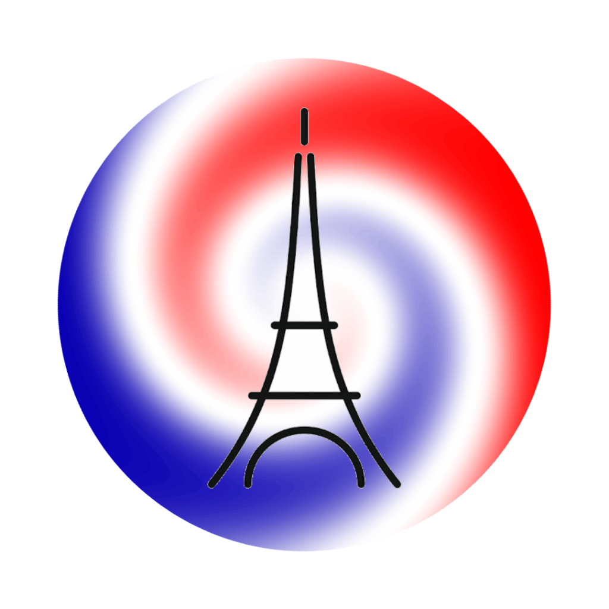
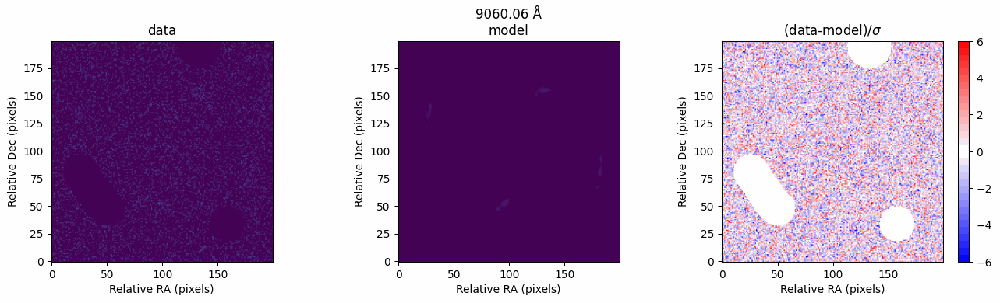

# IFUL: Integral Field Unit Lensing 

<!-- badges: start -->
[](https://github.com/williyamshoe/iful/actions/workflows/test.yml)
[](https://pypi.org/project/iful/)
[](https://www.python.org/downloads/)
[](https://opensource.org/licenses/MIT)
<!-- badges: end -->

A Python pipeline for joint-modeling strong gravitational lensing and source kinematics

# 

---

## Statement of Need

Strong gravitational lensing is a cornerstone probe of observational cosmology—enabling independent measurements of the Hubble constant ($H_0$) to break the Hubble tension via time-delay cosmography, constraining the dark energy equation-of-state ($w$) and matter density ($\Omega_{\rm m, 0}$) via compound lensing systems, and probing dark matter substructure and high-redshift galaxy structures. All of these cosmological and astrophysical applications fundamentally depend on the ability to precisely and accurately model the lensing mass distribution.

Traditional lens modeling pipelines rely almost exclusively on 2D imaging data (lensed image positions and brightness arcs), occasionally supplemented by 1D integrated slit spectroscopy of the deflector galaxy. However, imaging-only pipelines face key limitations:
1. **Mass-Sheet and Profile Degeneracies**: Imaging constraints alone often leave the radial mass slope and mass profile parameters underspecified.
2. **Lens/Source Light Contamination**: Bright deflector galaxy light can overlap with source arcs and obscure faint, demagnified central images inside the Einstein radius that strongly constrain the inner mass slope.

**`IFUL` (Integral Field Unit Lensing)** overcomes these limitations by introducing an **end-to-end forward-modeling framework** that incorporates the spatially resolved dynamics of the source galaxy directly into the macro lens model. Observed with modern Integral Field Spectroscopy instruments (e.g., *JWST* NIRSpec, VLT MUSE, Keck KCWI/KCRM, and OSIRIS), `IFUL` forward-models every individual spatial pixel (spaxel) in the 3D IFU datacube from a joint parameterization of:
- **Macro Lens Mass & Light Profiles** (via [`lenstronomy`](https://github.com/lenstronomy/lenstronomy), or binned profiles),
- **Source Line-of-Sight Velocity Fields ($v_{\mathrm{los}}$)** (Arctan, Tanh, Multi-parameter, or binned profiles),
- **Source Velocity Dispersion Fields ($\sigma_v$)** (Exponential, constant, Keplerian, or binned profiles).

By leveraging dynamical markers within lensed arcs as additional kinematic constraints, isolating source emission line light to completely remove lens-light contamination, and reconstructing unlensed source dynamics across multiple lensed images, **`IFUL`** provides tighter constraints on lens mass profiles, profile slopes, and high-redshift source dynamics than imaging data alone.

---

## Key Features

- **Joint Lensing & Kinematics Modeling**: Simultaneously model 2D image-plane lensing light/mass distributions and 3D IFU datacube velocity and dispersion fields.
- **Flexible Kinematic Profiles**: Support for standard kinematic models including Arctan velocity curves, Tanh profiles, multi-parameter profiles, central supermassive black hole (BH) influence, and custom dispersion profiles.
- **Datacube Processing (`ImageSet`)**: Built-in continuum subtraction, outlier rejection (IQR), custom aperture masking, white-light image collapse, and noise estimation.
- **Fast Linear Inversion**: Accelerated linear solver for source plane flux maps to reduce MCMC/optimization overhead.
- **Simulation API (`simulation_api`)**: Easily generate mock JWST NIRSpec or ground-based IFU lensed galaxy datacubes with realistic PSF convolution and instrument noise for mock challenges and forecast studies.
- **Power Binning Support**: Integrated adaptive Power spatial binning (an improvement to traditional Voronoi binning) using `powerbin`.

---

## Installation

### Option 1: Install via `pip` (Recommended)

```bash
pip install iful
```

### Option 2: Install from Source

Clone the repository and install in editable mode:

```bash
git clone https://github.com/williyamshoe/iful.git
cd iful
pip install -e .
```

To install with testing dependencies:

```bash
pip install -e .[test]
```

---

## Quickstart Example

Here is a quick example creating a mock lensed IFU datacube and configuring the lensing and kinematics models:

```python
import numpy as np
from iful.simulation_api import (
    SimulationMockImageSet, 
    create_simulation_models, 
    run_galaxy_simulation, 
    add_instrument_noise
)

psf_path = "path/to/psf"
zs = 3.8

imset = SimulationMockImageSet(
    size=40,
    pixscale_arcsec=0.075,
    zs=zs,
    wavelengths_full=np.linspace(23650.0 - 300, 24250.0 + 300, 120),
    psf_path=psf_path
)
imset.restwave_peaks = [4959.0, 5007.0]
# parameters format: [z, sigma_ang, amp_0, ratio (5007/4959 = 3.0)]
imset.init_spec_fit = np.array([zs, 24.0, 1.0, 3.0])

# Setup FlatModel and IFULModel from simulation API
fm, ifulmodel = create_simulation_models(
    imset,
    theta_E=1.0,
    source_x=-0.01,
    source_y=-0.01,
    iful_profiles=["ARCTAN", "CONSTANT_FITTED_BH", "SERSIC"]
)

# Extract parameters
sim_params = [
    # EPL_Q_PHI (6 params): theta_E, gamma, q, phi, center_x, center_y
    1., 1.8, 0.75, 0.5, -0.1, -0.1,
    # SHEAR (2 params): gamma1, gamma2
    0.05, -0.05,
    # Source (6 params): R_sersic, n_sersic, e1, e2, center_x, center_y
    0.3, 1.2, 0.0, 0.0, -0.01, -0.01,
    # v_los (4 params): v_pa, v_a, v_b, v_c (sys_vel = zs * c)
    -45.0, 300.0, 15, zs * 299792,
    # v_disp (2 params): constant velocity dispersion of 50 km/s and log10 BH mass of 9.0
    50.0, 9.0,
    # flx (1 param): scale factor
    1e6
]

# Run galaxy simulation from API
results = run_galaxy_simulation(
    ifulmodel, 
    sim_params, 
    source_grid_size=100,
    source_grid_scale=0.015
)
lensed_image, unlensed_source, ra_crit, dec_crit, ra_caustic, dec_caustic = results

res, simulated_datacube = ifulmodel.generate_residuals(
    sim_params, 
    return_datacube=True, 
    vd_plots=False
)
simulated_datacube_noisy, bg_noise = add_instrument_noise(
    simulated_datacube, 
    bg_noise_std_frac=0.02, 
    seed=42
)
```

For comprehensive tutorials, check out the notebooks in the [`examples/`](examples/) directory. In particular, see the `s4c_` series of notebooks for a tutorial on simulating and fitting to real data.

---

## Repository & Package Structure

```
iful/
├── src/iful/                # Package source code 
│   ├── __init__.py
│   ├── image_set.py         # 3D Datacube processing & masking
│   ├── flat_modeling.py     # Lensing model wrapper
│   ├── iful_modeling.py     # Joint lensing + IFU kinematics model
│   ├── simulation_api.py    # Mock dataset creation & FITS export
│   └── util.py              # Mathematical profiles & utilities
├── examples/                # Jupyter notebook tutorials 
├── tests/                   # Automated pytest suite
└── docs/assets/             # README figures
```

---

## Running Tests

To run the automated test suite locally:

```bash
pytest -v --cov=iful
```

---

## Contributing

Contributions, bug reports, and feature requests are welcome! Please feel free to open an issue or submit a pull request on GitHub.

See [`CONTRIBUTING.md`](CONTRIBUTING.md) for details on guidelines and local setup.

---

## License

Distributed under the **MIT License**. See [`LICENSE`](LICENSE) for details.

---

## Citation

If you use **IFUL** in your research, please cite:

TODO
